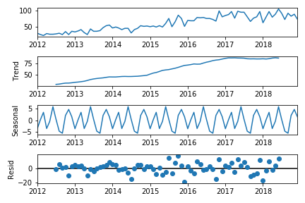
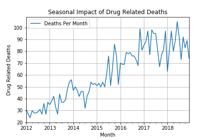
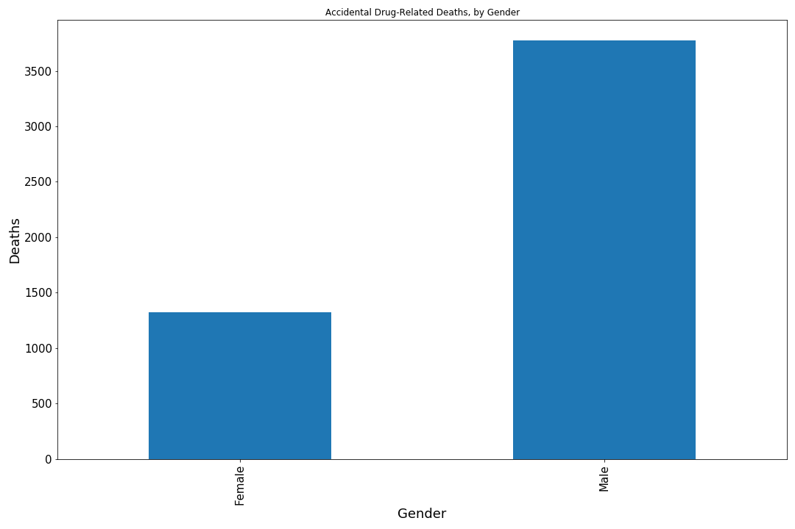
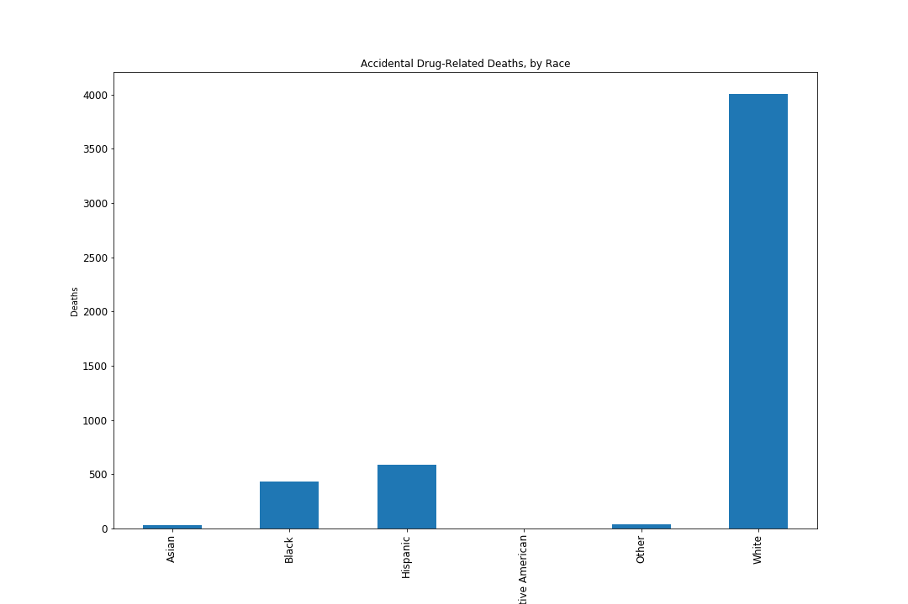
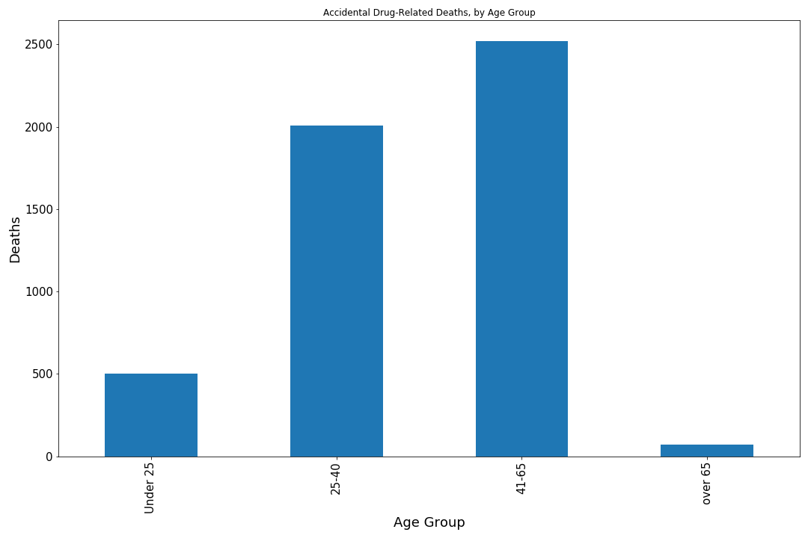
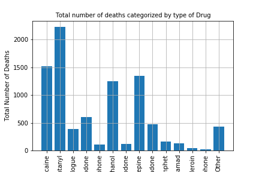

# Accidental-Drug-Related-Deaths

## Summary

Analyzing drug related deaths in Connecticut between 2012-2018 to identify key factors responsible and draw conclusions that could help increase public awareness and allow responsible agencies to take preventive actions.

## Data Collection and Scrubbing

### Data Source
```
https://catalog.data.gov/dataset/accidental-drug-related-deaths-january-2012-sept-2015
```

### Scrubbing

* Fix NaN values.
* Fix data type of date fields to datetime.
* Drop rows missing key values necessary for analysis. 
* Drop columns non relevant for analysis.

## Result Interpretation

### Are accidental drug related deaths increasing year over year?

Trend component of the plot below clearly indicates constant increase in drug related deaths every year. 

### Is there a seasonal impact on drug related deaths? 
There does appear to be a seasonal impact on mortality rate, with increases seen during the Winter/Holiday season.


### Does age, gender, and race have any impact on these deaths?

* Gender appears important – Females accounted for 26% of deaths, but according to the US Census Bureau, female population for Connecticut is 51.2%.  This implies that males are more at-risk behavior and therefore have a higher death rate. 

*	Race does not appear to be a determining factor in mortality – 78% of deaths were attributed to White race.  However according to US Census Bureau, Connecticut accounts for 80% of white population, hence death rate by race is in line with general population distribution. 

*	Age appears to be a significant factor. 25-40 age group accounts for 39% of the mortality rate, followed by 41-65 age group with another 49%. These groups can be expected to have the most available disposable income, and therefore more likely to be able to indulge in drug use.  

Deaths Per Gender                 |  Deaths Per Race                |Deaths Per Age Group
:--------------------------------:|:-------------------------------:|----------------------------------:
  | |

### Are there particular drugs impacting these deaths? 

* The top three drugs that are the cause of accidental drug-related deaths are:
  *	Heroin
  *	Fentanyl
  *	Cocaine


